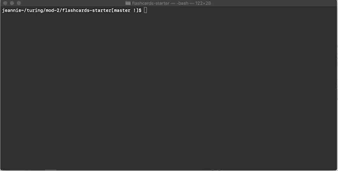

# FlashCards

## About This Project

FlashCards is a Module-2 individual student project where we use classes and a dataset to produce a game in the terminal. Users will quiz themselves, much like handwritten flash cards, on their Javascript knowledge except instead of paper flashcards, each card is an object inside of our dataset. 

## To Play!

To play, open up the terminal and set up the file path leading to these this directory. In the terminal, type `node index.js` and press the `enter` key. This will prompt the first question. Select your answer by indicating the appropriate number and again press the `enter` key. You will immediately be told if your answer is `correct!` or `incorrect!`. Press the `enter ` key to continue onto the next question. When you have answered all 30 questions, the game will tell you the percentage you got correct! Good luck and have a blast!

